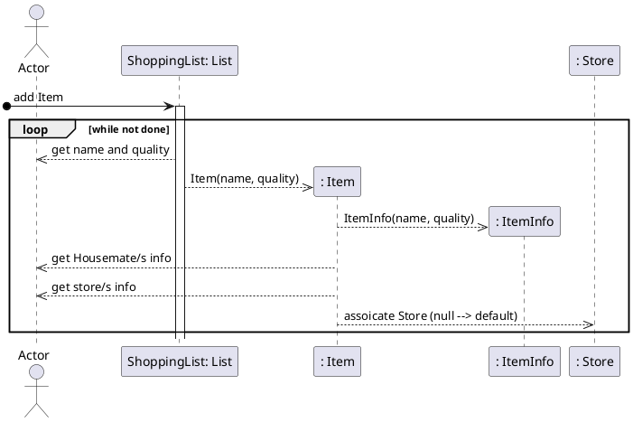
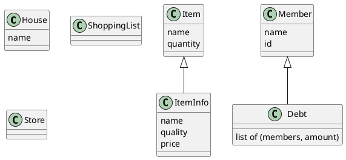

# Add Item Domain Model
```plantuml
@startuml
testdot
hide circle
hide empty methods
' classes
class House{
    name
}
class ShoppingList{ 
}
class Item{
    name
    avalibility
}
class Store{
    address
    name
}
class ItemInfo{
    price
    image
    quantity
}
class Debt{
    address
    name
}
class Housemate{   
    name
    paymentInfo
    housemateId
}

' associations
House "1" -- "1..*" Housemate : \tContains\t\t
House "1" -- "1" ShoppingList : \tContains\t\t
Housemate "0" - "1..*" Item : \tOwn\t\t
ShoppingList "0" - "0..*" Item : \tContains\t\t
Housemate "0" -- "*" Debt : \tOwes\t\t
Item "*" -- "1...*" Store : \tFrom\t\t
Item "*" -- "1...*" ItemInfo : \tDescribed by \t\t
ItemInfo "*" -left- "1..*"  Store : \tGets info from\t\t
@enduml
```
# Get Item Sequence Diagram


# Class Diagram

