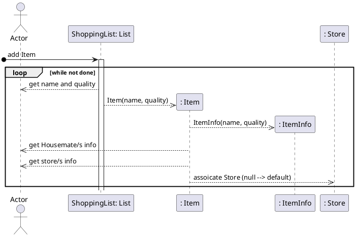

# Get Item Sequence Diagram

```plantuml

@startuml
actor Actor as Actor
participant "ShoppingList: List" as shoppingList
participant ": Item" as item
participant ": ItemInfo" as itemInfo
participant ": Store" as store


[o-> shoppingList : add Item
activate shoppingList

loop while not done
    shoppingList -->> Actor  : get name and quality
    shoppingList -->> item **: Item(name, quality)
    item -->> itemInfo **: ItemInfo(name, quality)
    item -->> Actor : get Housemate/s info
    item -->> Actor : get store/s info
    item -->> store : assoicate Store (null --> default)

end

activate shoppingList


@enduml
```
