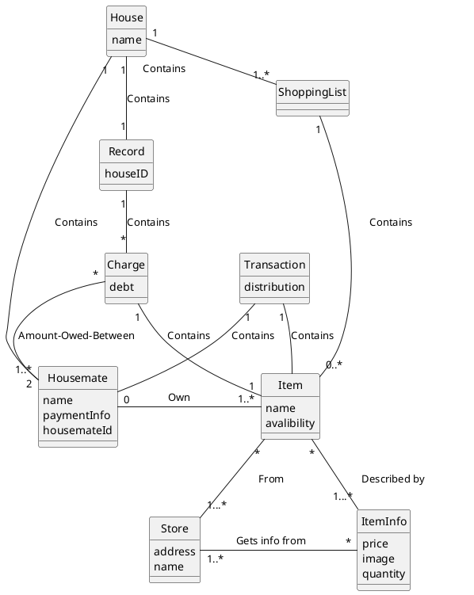
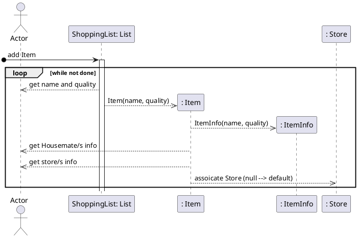
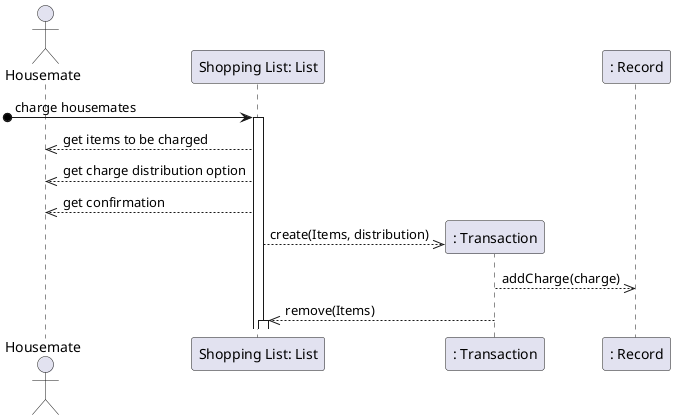
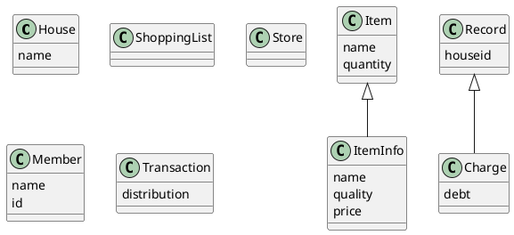

# Add Item Domain Model

```plantuml
@startuml
hide circle
class House{
    name
}
class ShoppingList{ 
}
class Item{
    name
    avalibility
}
class Store{
    address
    name
}
class ItemInfo{
    price
    image
    quantity
}
class Record{
    houseID
}
class Charge{
    debt
}
class Housemate{   
    name
    paymentInfo
    housemateId
}
class Transaction{
    distribution
}

' associations
House "1" -- "1..*" Housemate : \tContains\t\t
House "1" -right- "1..*" ShoppingList : \tContains\t\t
House "1" -- "1" Record : Contains
Housemate "0" - "1..*" Item : \tOwn\t\t
ShoppingList "1" - "0..*" Item : \tContains\t\t
Item "*" -- "1...*" Store : \tFrom\t\t
Item "*" -- "1...*" ItemInfo : \tDescribed by \t\t
ItemInfo "*" -left- "1..*"  Store : \tGets info from\t\t
Record "1" -- "*" Charge : Contains
Charge "1" --  "1" Item : Contains
Charge "*" -- "2" Housemate : Amount-Owed-Between
Transaction "1" -- Item : Contains
Transaction "1" -- Housemate : Contains
@enduml


```
# Get Item Sequence Diagram

```plantuml

@startuml
actor Actor as Actor
participant "ShoppingList: List" as shoppingList
participant ": Item" as item
participant ": ItemInfo" as itemInfo
participant ": Store" as store


[o-> shoppingList : add Item
activate shoppingList

loop while not done
    shoppingList -->> Actor  : get name and quality
    shoppingList -->> item **: Item(name, quality)
    item -->> itemInfo **: ItemInfo(name, quality)
    item -->> Actor : get Housemate/s info
    item -->> Actor : get store/s info
    item -->> store : assoicate Store (null --> default)

end

activate shoppingList


@enduml
```

# Charge Housemate Sequence Diagram

```plantuml

@startuml
actor Housemate as Actor
participant "Shopping List: List" as shoppingList
participant ": Transaction" as transaction
participant ": Record" as record


[o-> shoppingList : charge housemates
activate shoppingList

    shoppingList -->> Actor  : get items to be charged
    shoppingList -->> Actor  : get charge distribution option
    shoppingList -->> Actor  : get confirmation
    shoppingList -->> transaction** : create(Items, distribution)
    transaction -->> record : addCharge(charge)
    transaction -->> shoppingList : remove(Items)

activate shoppingList


@enduml
```

# Class Diagram

```plantuml
@startuml

class House {
    name
    }

class ShoppingList
class Item {
    name
    quantity 
    }
class ItemInfo {
    name
    quality
    price
    }
class Store
class Member {
    name
    id
    }

class Transaction {
    distribution
    }
class Record { 
    houseid
}

class Charge{
    debt
}
Item <|-- ItemInfo 

Record <|-- Charge
@enduml
```
