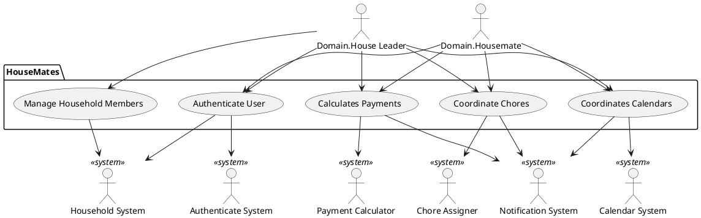

# Vision Document
##Introduction:

We envision an organizational application, Housemates, that will act as a hub for housemates to easily communicate and plan household chores, expenses, and schedules.  This application will allow housemates to have all of their logistical needs and reminders in one place on any Android device.

##Business case:

Our organizational software addresses customer needs that other products do not:

1. It’s the one-stop shop supporting multiple coordination services
2. It integrates calendar and chore assignment systems to offer optimal times to schedule chores/events with housemates
3. It keeps track of running tabs and pushes reminders for unpaid payments

##Key features summary:

+ Automatic calendar coordination
+ Payment capture and auditing
+ Locally saved system to support reminders when offline
+ Notification system for all tasks

##Stakeholder goals summary:

+ Domain.House leader: create house in-app, send invites to other housemates, remove housemates from house, all Domain.Housemate goals
+ Domain.Housemate: enter personal calendar, enter chores, scan receipts, confirm payments

##System context diagram:
