# Add Item Domain Model
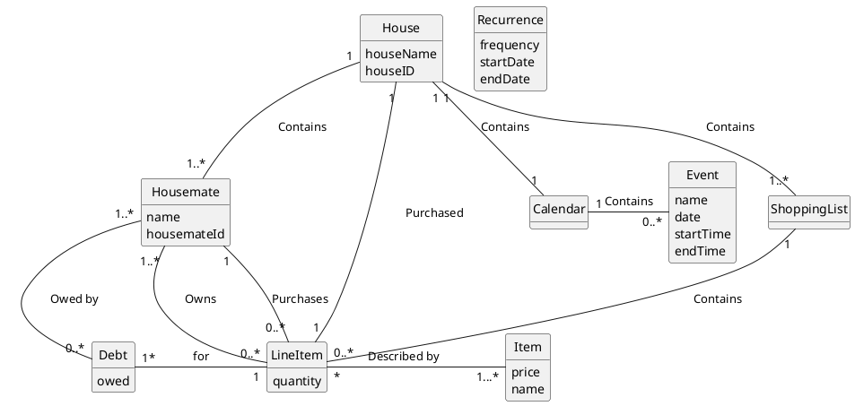

# Add Event to Calendar Sequence Diagram
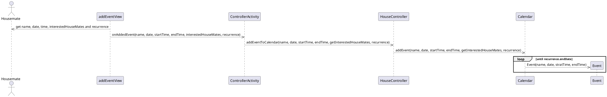

# Add Item to Shopping List Sequence Diagram
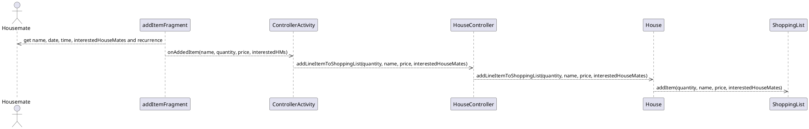


# Create House Sequence Diagram
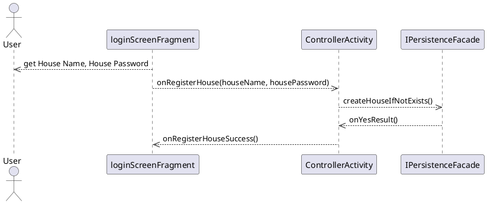

# Log in to House Sequence Diagram
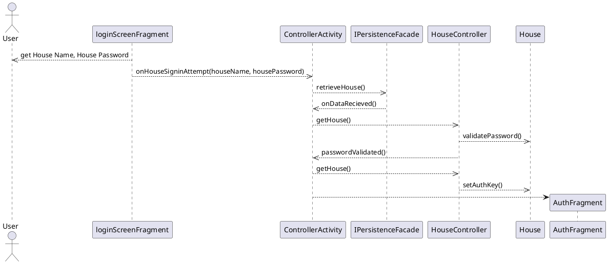

# Join House Sequence Diagram
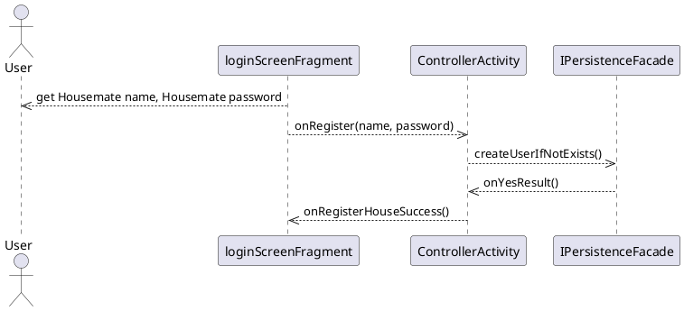

# Log in as User Sequence Diagram
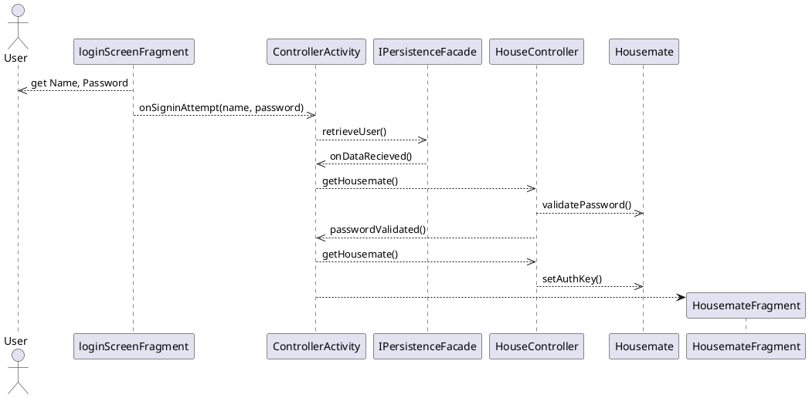
# Purchase Item Sequence Diagram
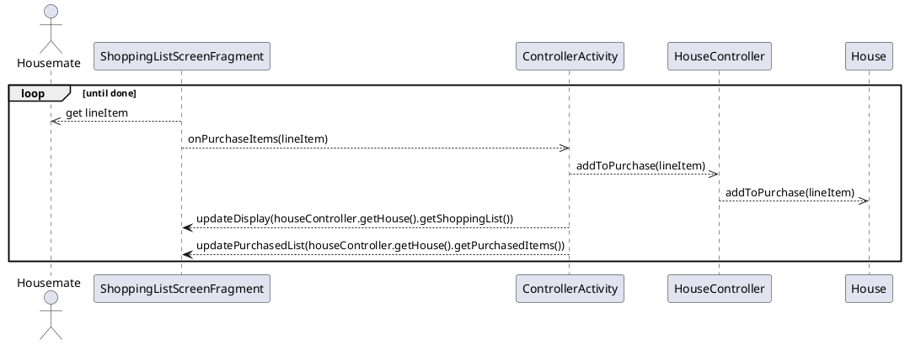

# Checkout Sequence Diagram
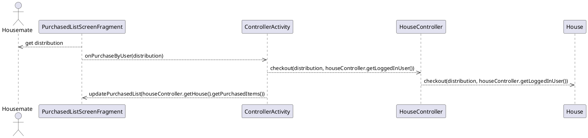


# Class Diagram for Domain
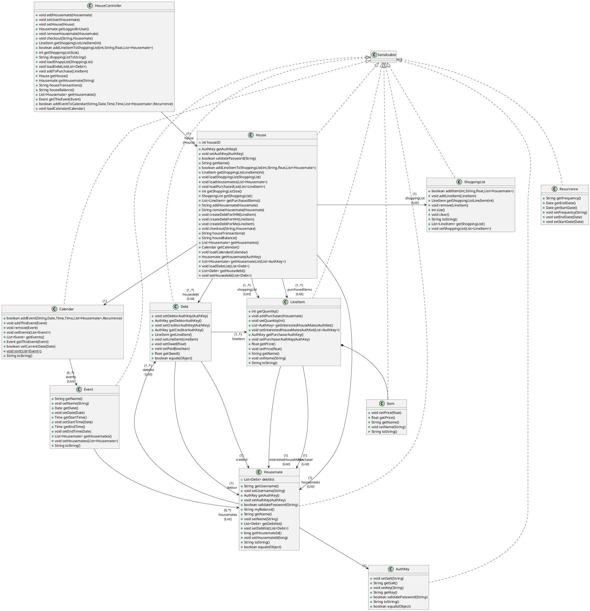

# Class Diagram for Controller
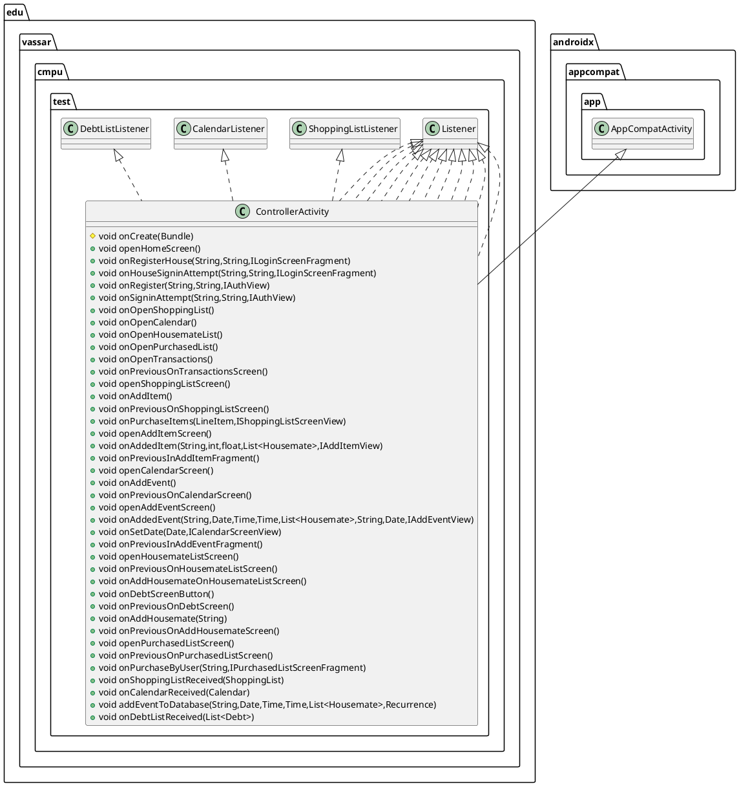

# Class Diagram for View
```plantuml
@startuml
interface edu.vassar.cmpu.test.view.calendarScreen.ICalendarScreenView {
~ void updateDisplay(Calendar)
}
interface edu.vassar.cmpu.test.view.calendarScreen.ICalendarScreenView.Listener {
~ void onAddEvent()
~ void onSetDate(Date,ICalendarScreenView)
~ void onPreviousOnCalendarScreen()
}
class edu.vassar.cmpu.test.view.calendarScreen.CalendarScreenFragment {
- Listener listener
- FragmentCalendarMonthBinding binding
+ void onCreate(Bundle)
+ View onCreateView(LayoutInflater,ViewGroup,Bundle)
+ void onViewCreated(View,Bundle)
+ void updateDisplay(Calendar)
}
interface edu.vassar.cmpu.test.view.addEventView.IAddEventView {
~ void getAddedHouseMates(List<Housemate>)
~ void updateDisplay(Calendar)
}
interface edu.vassar.cmpu.test.view.addEventView.IAddEventView.Listener {
~ void onAddedEvent(String,Date,Time,Time,List<Housemate>,String,Date,IAddEventView)
~ void onPreviousInAddEventFragment()
}
class edu.vassar.cmpu.test.view.addEventView.AddEventFragment {
- FragmentAddEventBinding binding
- Listener listener
+ void onCreate(Bundle)
+ View onCreateView(LayoutInflater,ViewGroup,Bundle)
+ void onViewCreated(View,Bundle)
+ void getAddedHouseMates(List<Housemate>)
- List<Housemate> CreateDialog(List<Housemate>,String,Date,Time,Time,String,Date)
+ void onAddedEvent(String,Date,Time,Time,ArrayList<Housemate>,String,Date)
+ void updateDisplay(Calendar)
+ void onItemSelected(AdapterView<?>,View,int,long)
+ void onNothingSelected(AdapterView<?>)
}


edu.vassar.cmpu.test.view.calendarScreen.ICalendarScreenView +.. edu.vassar.cmpu.test.view.calendarScreen.ICalendarScreenView.Listener
edu.vassar.cmpu.test.view.calendarScreen.ICalendarScreenView <|.. edu.vassar.cmpu.test.view.calendarScreen.CalendarScreenFragment
androidx.fragment.app.Fragment <|-- edu.vassar.cmpu.test.view.calendarScreen.CalendarScreenFragment
edu.vassar.cmpu.test.view.addEventView.IAddEventView +.. edu.vassar.cmpu.test.view.addEventView.IAddEventView.Listener
edu.vassar.cmpu.test.view.addEventView.IAddEventView <|.. edu.vassar.cmpu.test.view.addEventView.AddEventFragment
edu.vassar.cmpu.test.view.addEventView.OnItemSelectedListener <|.. edu.vassar.cmpu.test.view.addEventView.AddEventFragment
androidx.fragment.app.Fragment <|-- edu.vassar.cmpu.test.view.addEventView.AddEventFragment
@enduml
```

# Class Diagram for View Part 2
```plantuml
@startuml
class edu.vassar.cmpu.test.view.purchasedListScreen.PurchasedListScreenFragment {
- FragmentPurchasedBinding binding
- Listener listener
+ void onCreate(Bundle)
+ View onCreateView(LayoutInflater,ViewGroup,Bundle)
+ void updatePurchasedList(List<LineItem>)
+ void onViewCreated(View,Bundle)
+ void CreateDialog()
}
interface edu.vassar.cmpu.test.view.addItemView.IAddItemView {
~ void getHouseMates(List<Housemate>)
~ void updateDisplay(ShoppingList)
}
interface edu.vassar.cmpu.test.view.addItemView.IAddItemView.Listener {
~ void onAddedItem(String,int,float,List<Housemate>,IAddItemView)
~ void onPreviousInAddItemFragment()
}
interface edu.vassar.cmpu.test.view.purchasedListScreen.IPurchasedListScreenFragment {
~ void updatePurchasedList(List<LineItem>)
}
interface edu.vassar.cmpu.test.view.purchasedListScreen.IPurchasedListScreenFragment.Listener {
~ void onPreviousOnPurchasedListScreen()
~ void onPurchaseByUser(String,IPurchasedListScreenFragment)
}
interface edu.vassar.cmpu.test.view.shoppingListScreen.IShoppingListScreenView {
~ void updateDisplay(ShoppingList)
~ void purchaseItems(ShoppingList)
~ void updatePurchasedList(List<LineItem>)
}
interface edu.vassar.cmpu.test.view.shoppingListScreen.IShoppingListScreenView.Listener {
~ void onAddItem()
~ void onPurchaseItems(LineItem,IShoppingListScreenView)
~ void onPreviousOnShoppingListScreen()
}
class edu.vassar.cmpu.test.view.addItemView.AddItemFragment {
- {static} String ITEM_NAME
- {static} String ITEM_QUANTITY
- {static} String ITEM_PRICE
- FragmentAddItemBinding binding
- Listener listener
- HouseController house
+ void onCreate(Bundle)
+ View onCreateView(LayoutInflater,ViewGroup,Bundle)
+ void onViewCreated(View,Bundle)
- void CreateDialog(List<Housemate>,String,int,float)
+ void updateDisplay(ShoppingList)
+ void getHouseMates(List<Housemate>)
+ void onSaveInstanceState(Bundle)
+ void onViewStateRestored(Bundle)
}
class edu.vassar.cmpu.test.view.shoppingListScreen.ShoppingListScreenFragment {
- Listener listener
- FragmentShoppingListScreenBinding binding
+ void onCreate(Bundle)
+ View onCreateView(LayoutInflater,ViewGroup,Bundle)
+ void onViewCreated(View,Bundle)
- ArrayList<LineItem> CreateDialog(ShoppingList)
+ void updateDisplay(ShoppingList)
+ void onPurchaseItems(LineItem)
+ void updatePurchasedList(List<LineItem>)
+ void purchaseItems(ShoppingList)
}


edu.vassar.cmpu.test.view.purchasedListScreen.IPurchasedListScreenFragment <|.. edu.vassar.cmpu.test.view.purchasedListScreen.PurchasedListScreenFragment
androidx.fragment.app.Fragment <|-- edu.vassar.cmpu.test.view.purchasedListScreen.PurchasedListScreenFragment
edu.vassar.cmpu.test.view.addItemView.IAddItemView +.. edu.vassar.cmpu.test.view.addItemView.IAddItemView.Listener
edu.vassar.cmpu.test.view.purchasedListScreen.IPurchasedListScreenFragment +.. edu.vassar.cmpu.test.view.purchasedListScreen.IPurchasedListScreenFragment.Listener
edu.vassar.cmpu.test.view.shoppingListScreen.IShoppingListScreenView +.. edu.vassar.cmpu.test.view.shoppingListScreen.IShoppingListScreenView.Listener
edu.vassar.cmpu.test.view.addItemView.IAddItemView <|.. edu.vassar.cmpu.test.view.addItemView.AddItemFragment
androidx.fragment.app.Fragment <|-- edu.vassar.cmpu.test.view.addItemView.AddItemFragment
edu.vassar.cmpu.test.view.shoppingListScreen.IShoppingListScreenView <|.. edu.vassar.cmpu.test.view.shoppingListScreen.ShoppingListScreenFragment
androidx.fragment.app.Fragment <|-- edu.vassar.cmpu.test.view.shoppingListScreen.ShoppingListScreenFragment
@enduml
```

# Class Diagram for View Part 3
```plantuml
@startuml
class edu.vassar.cmpu.test.view.homeScreen.HomeScreenFragment {
- Listener listener
- FragmentHomeScreenBinding binding
+ void onCreate(Bundle)
+ View onCreateView(LayoutInflater,ViewGroup,Bundle)
+ void onViewCreated(View,Bundle)
}
interface edu.vassar.cmpu.test.view.loginScreen.ILoginScreenFragment {
~ void onRegisterHouseSuccess()
~ void onInvalidHouseCredentials()
~ void onHouseAlreadyExists()
}
interface edu.vassar.cmpu.test.view.loginScreen.ILoginScreenFragment.Listener {
~ void onRegisterHouse(String,String,ILoginScreenFragment)
~ void onHouseSigninAttempt(String,String,ILoginScreenFragment)
}
interface edu.vassar.cmpu.test.view.homeScreen.IHomeScreenFragment {
}
interface edu.vassar.cmpu.test.view.homeScreen.IHomeScreenFragment.Listener {
+ void onOpenShoppingList()
+ void onOpenCalendar()
+ void onOpenHousemateList()
+ void onOpenPurchasedList()
+ void onOpenTransactions()
}
class edu.vassar.cmpu.test.view.authScreen.AuthFragment {
- {static} String IS_REGISTERED
- Listener listener
- FragmentAuthBinding binding
- boolean isRegistered
+ View onCreateView(LayoutInflater,ViewGroup,Bundle)
+ void onViewCreated(View,Bundle)
+ void onSaveInstanceState(Bundle)
+ void onRegisterSuccess()
- void activateRegisteredConfig()
+ void onInvalidCredentials()
+ void onUserAlreadyExists()
- void displayMessage(int)
}
class edu.vassar.cmpu.test.view.loginScreen.LoginScreenFragment {
- {static} String IS_REGISTERED
- ILoginScreenFragment.Listener listener
- FragmentLoginScreenBinding binding
- boolean isRegistered
+ void onCreate(Bundle)
+ View onCreateView(LayoutInflater,ViewGroup,Bundle)
+ void onViewCreated(View,Bundle)
+ void onSaveInstanceState(Bundle)
+ void onRegisterHouseSuccess()
- void activateRegisteredConfig()
+ void onInvalidHouseCredentials()
+ void onHouseAlreadyExists()
- void displayMessage(int)
}
interface edu.vassar.cmpu.test.view.authScreen.IAuthView {
~ void onRegisterSuccess()
~ void onInvalidCredentials()
~ void onUserAlreadyExists()
}
interface edu.vassar.cmpu.test.view.authScreen.IAuthView.Listener {
~ void onRegister(String,String,IAuthView)
~ void onSigninAttempt(String,String,IAuthView)
}


edu.vassar.cmpu.test.view.homeScreen.IHomeScreenFragment <|.. edu.vassar.cmpu.test.view.homeScreen.HomeScreenFragment
androidx.fragment.app.Fragment <|-- edu.vassar.cmpu.test.view.homeScreen.HomeScreenFragment
edu.vassar.cmpu.test.view.loginScreen.ILoginScreenFragment +.. edu.vassar.cmpu.test.view.loginScreen.ILoginScreenFragment.Listener
edu.vassar.cmpu.test.view.homeScreen.IHomeScreenFragment +.. edu.vassar.cmpu.test.view.homeScreen.IHomeScreenFragment.Listener
edu.vassar.cmpu.test.view.authScreen.IAuthView <|.. edu.vassar.cmpu.test.view.authScreen.AuthFragment
androidx.fragment.app.Fragment <|-- edu.vassar.cmpu.test.view.authScreen.AuthFragment
edu.vassar.cmpu.test.view.loginScreen.ILoginScreenFragment <|.. edu.vassar.cmpu.test.view.loginScreen.LoginScreenFragment
androidx.fragment.app.Fragment <|-- edu.vassar.cmpu.test.view.loginScreen.LoginScreenFragment
edu.vassar.cmpu.test.view.authScreen.IAuthView +.. edu.vassar.cmpu.test.view.authScreen.IAuthView.Listener
@enduml
```

# Class Diagram for View Part 4
```plantuml
@startuml
class edu.vassar.cmpu.test.view.housemateListScreen.HousemateListScreenFragment {
- Listener listener
- FragmentHousematesBinding binding
+ void onCreate(Bundle)
+ View onCreateView(LayoutInflater,ViewGroup,Bundle)
+ void onViewCreated(View,Bundle)
+ void updateDisplay(List<Housemate>)
}
interface edu.vassar.cmpu.test.view.housemateListScreen.addHousemate.IAddHousemate {
}
interface edu.vassar.cmpu.test.view.housemateListScreen.addHousemate.IAddHousemate.Listener {
~ void onAddHousemate(String)
~ void onPreviousOnAddHousemateScreen()
}
interface edu.vassar.cmpu.test.view.housemateListScreen.IHousemateListScreenFragment {
~ void updateDisplay(List<Housemate>)
}
interface edu.vassar.cmpu.test.view.housemateListScreen.IHousemateListScreenFragment.Listener {
~ void onPreviousOnHousemateListScreen()
~ void onAddHousemateOnHousemateListScreen()
~ void onDebtScreenButton()
}
interface edu.vassar.cmpu.test.view.housemateListScreen.debtScreen.IDebtScreenFragment {
+ void updateDisplay(String)
}
interface edu.vassar.cmpu.test.view.housemateListScreen.debtScreen.IDebtScreenFragment.Listener {
~ void onPreviousOnDebtScreen()
}
class edu.vassar.cmpu.test.view.housemateListScreen.addHousemate.AddHousemateFragment {
~ FragmentAddHousemateBinding binding
~ Listener listener
+ void onCreate(Bundle)
+ View onCreateView(LayoutInflater,ViewGroup,Bundle)
+ void onViewCreated(View,Bundle)
}
class edu.vassar.cmpu.test.view.housemateListScreen.debtScreen.DebtScreenFragment {
~ FragmentDebtScreenBinding binding
~ Listener listener
+ void onCreate(Bundle)
+ View onCreateView(LayoutInflater,ViewGroup,Bundle)
+ void onViewCreated(View,Bundle)
+ void updateDisplay(String)
}
interface edu.vassar.cmpu.test.view.transactionsScreen.ITransactionsScreenFragment {
~ void updateDisplay(String)
}
interface edu.vassar.cmpu.test.view.transactionsScreen.ITransactionsScreenFragment.Listener {
~ void onPreviousOnTransactionsScreen()
}
class edu.vassar.cmpu.test.view.transactionsScreen.TransactionsScreenFragment {
~ FragmentTransactionsScreenBinding binding
~ Listener listener
+ void onCreate(Bundle)
+ View onCreateView(LayoutInflater,ViewGroup,Bundle)
+ void onViewCreated(View,Bundle)
+ void updateDisplay(String)
}


edu.vassar.cmpu.test.view.housemateListScreen.IHousemateListScreenFragment <|.. edu.vassar.cmpu.test.view.housemateListScreen.HousemateListScreenFragment
androidx.fragment.app.Fragment <|-- edu.vassar.cmpu.test.view.housemateListScreen.HousemateListScreenFragment
edu.vassar.cmpu.test.view.housemateListScreen.addHousemate.IAddHousemate +.. edu.vassar.cmpu.test.view.housemateListScreen.addHousemate.IAddHousemate.Listener
edu.vassar.cmpu.test.view.housemateListScreen.IHousemateListScreenFragment +.. edu.vassar.cmpu.test.view.housemateListScreen.IHousemateListScreenFragment.Listener
edu.vassar.cmpu.test.view.housemateListScreen.debtScreen.IDebtScreenFragment +.. edu.vassar.cmpu.test.view.housemateListScreen.debtScreen.IDebtScreenFragment.Listener
edu.vassar.cmpu.test.view.housemateListScreen.addHousemate.IAddHousemate <|.. edu.vassar.cmpu.test.view.housemateListScreen.addHousemate.AddHousemateFragment
androidx.fragment.app.Fragment <|-- edu.vassar.cmpu.test.view.housemateListScreen.addHousemate.AddHousemateFragment
edu.vassar.cmpu.test.view.housemateListScreen.debtScreen.IDebtScreenFragment <|.. edu.vassar.cmpu.test.view.housemateListScreen.debtScreen.DebtScreenFragment
androidx.fragment.app.Fragment <|-- edu.vassar.cmpu.test.view.housemateListScreen.debtScreen.DebtScreenFragment
edu.vassar.cmpu.test.view.transactionsScreen.ITransactionsScreenFragment +.. edu.vassar.cmpu.test.view.transactionsScreen.ITransactionsScreenFragment.Listener
edu.vassar.cmpu.test.view.transactionsScreen.ITransactionsScreenFragment <|.. edu.vassar.cmpu.test.view.transactionsScreen.TransactionsScreenFragment
androidx.fragment.app.Fragment <|-- edu.vassar.cmpu.test.view.transactionsScreen.TransactionsScreenFragment
@enduml
```

# Class Diagram for Persistence
```plantuml
@startuml
class edu.vassar.cmpu.test.persistence.FirestoreFacade {
~ FirebaseFirestore db
+ String HOUSE_NAME
+ void setHouseName(String)
+ void saveHousemate(Housemate)
+ void retrieveHousemateList(HousematesListListener)
+ void saveLineItem(LineItem)
+ void retrieveShoppingList(ShoppingListListener)
+ void saveEvent(Event)
+ void retrieveCalendar(CalendarListener)
+ void saveLineItemPL(LineItem)
+ void onCheckOut()
+ void updateHousemateDebt(List<Housemate>)
+ void retrieveDebtList(DebtListListener)
+ void retrievePurchaseList(PurchaseListListener)
+ void saveDebtList(List<Debt>,int)
+ void createUserIfNotExists(Housemate,BinaryResultListener)
+ void retrieveUser(String,DataListener<Housemate>)
+ void createHouseIfNotExists(House,BinaryResultListener)
+ void retrieveHouse(String,DataListener<House>)
}
interface edu.vassar.cmpu.test.persistence.IPersistenceFacade {
~ void setHouseName(String)
~ void saveLineItem(LineItem)
~ void retrieveShoppingList(ShoppingListListener)
~ void saveEvent(Event)
~ void retrieveCalendar(CalendarListener)
~ void retrievePurchaseList(PurchaseListListener)
~ void saveHousemate(Housemate)
~ void retrieveHousemateList(HousematesListListener)
~ void saveLineItemPL(LineItem)
~ void onCheckOut()
~ void updateHousemateDebt(List<Housemate>)
~ void retrieveDebtList(DebtListListener)
~ void saveDebtList(List<Debt>,int)
~ void createUserIfNotExists(Housemate,BinaryResultListener)
~ void retrieveUser(String,DataListener<Housemate>)
~ void createHouseIfNotExists(House,BinaryResultListener)
~ void retrieveHouse(String,DataListener<House>)
}
interface edu.vassar.cmpu.test.persistence.IPersistenceFacade.DataListener {
~ void onDataReceived(T)
~ void onNoDataFound()
}
interface edu.vassar.cmpu.test.persistence.IPersistenceFacade.BinaryResultListener {
~ void onYesResult()
~ void onNoResult()
}
interface edu.vassar.cmpu.test.persistence.IPersistenceFacade.ShoppingListListener {
~ void onShoppingListReceived(ShoppingList)
}
interface edu.vassar.cmpu.test.persistence.IPersistenceFacade.CalendarListener {
~ void onCalendarReceived(Calendar)
}
interface edu.vassar.cmpu.test.persistence.IPersistenceFacade.PurchaseListListener {
~ void onPurchaseListReceived(List<LineItem>)
}
interface edu.vassar.cmpu.test.persistence.IPersistenceFacade.HousematesListListener {
~ void onHousemateListReceived(List<Housemate>)
}
interface edu.vassar.cmpu.test.persistence.IPersistenceFacade.DebtListListener {
~ void onDebtListReceived(List<Debt>)
}


edu.vassar.cmpu.test.persistence.IPersistenceFacade <|.. edu.vassar.cmpu.test.persistence.FirestoreFacade
edu.vassar.cmpu.test.persistence.IPersistenceFacade +.. edu.vassar.cmpu.test.persistence.IPersistenceFacade.DataListener
edu.vassar.cmpu.test.persistence.IPersistenceFacade +.. edu.vassar.cmpu.test.persistence.IPersistenceFacade.BinaryResultListener
edu.vassar.cmpu.test.persistence.IPersistenceFacade +.. edu.vassar.cmpu.test.persistence.IPersistenceFacade.ShoppingListListener
edu.vassar.cmpu.test.persistence.IPersistenceFacade +.. edu.vassar.cmpu.test.persistence.IPersistenceFacade.CalendarListener
edu.vassar.cmpu.test.persistence.IPersistenceFacade +.. edu.vassar.cmpu.test.persistence.IPersistenceFacade.PurchaseListListener
edu.vassar.cmpu.test.persistence.IPersistenceFacade +.. edu.vassar.cmpu.test.persistence.IPersistenceFacade.HousematesListListener
edu.vassar.cmpu.test.persistence.IPersistenceFacade +.. edu.vassar.cmpu.test.persistence.IPersistenceFacade.DebtListListener
@enduml
```

# Class Diagram Connections
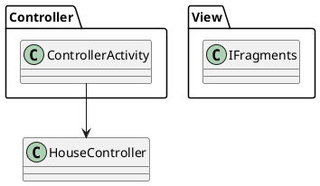
