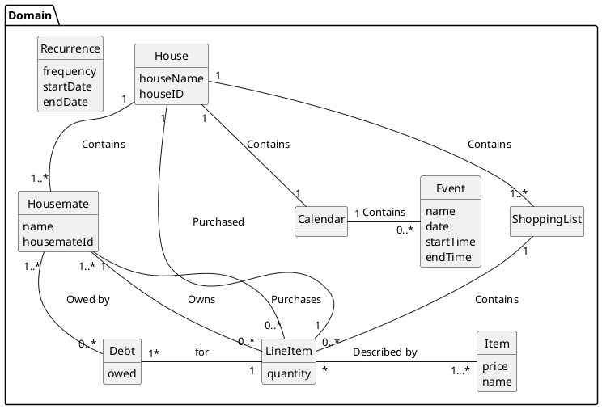
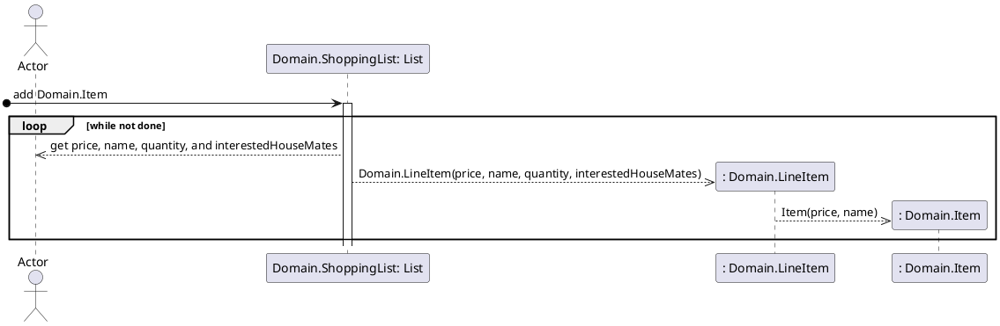
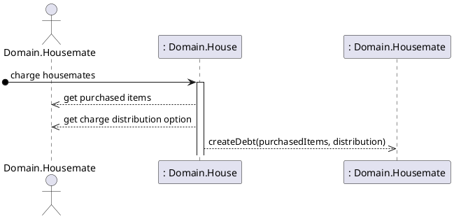
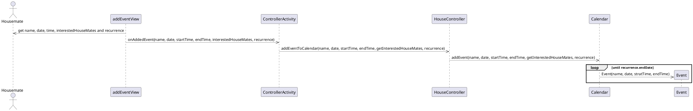
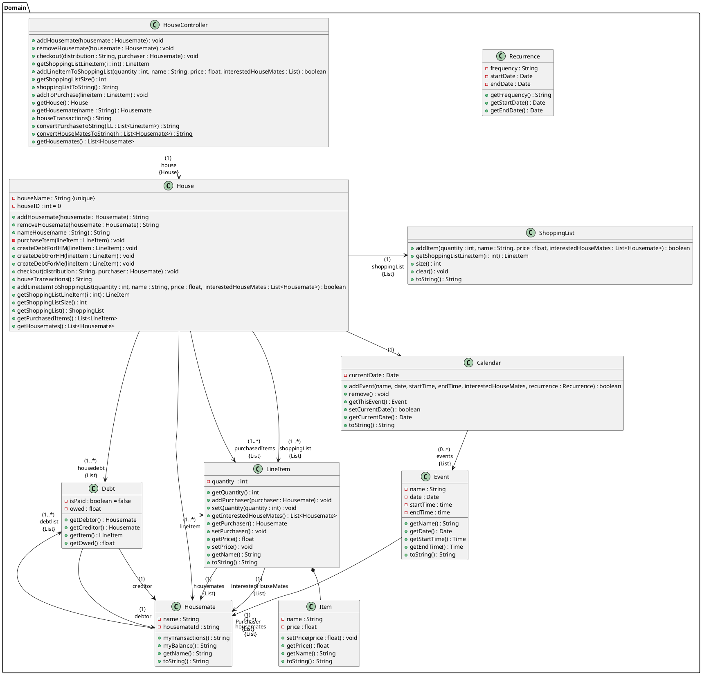
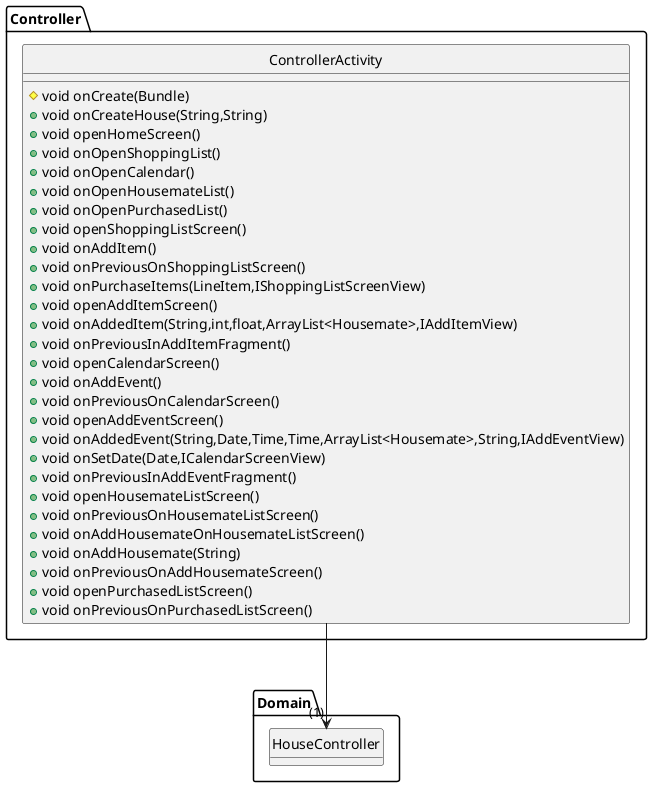

# Add Domain.Item Domain Model

# Get Domain.Item Sequence Diagram


# Charge Domain.Housemate Sequence Diagram


# Add Event to Calendar


# Class Diagram for Model


# Class Diagram for Controller


# Class Diagram for View
```plantuml
@startuml

class View.housemateListScreen.addHousemate.AddHousemateFragment {
~ FragmentAddHousemateBinding binding
~ Listener listener
+ void onCreate(Bundle)
+ View onCreateView(LayoutInflater,ViewGroup,Bundle)
+ void onViewCreated(View,Bundle)
}

interface View.addEventView.IAddEventView {
~ void getAddedHouseMates(ArrayList<Housemate>)
~ void updateDisplay(Calendar)
}
interface View.addEventView.IAddEventView.Listener {
~ void onAddedEvent(String,Date,Time,Time,ArrayList<Housemate>,String,IAddEventView)
~ void onPreviousInAddEventFragment()
}

class View.housemateListScreen.HousemateListScreenFragment {
- Listener listener
- FragmentHousematesBinding binding
+ void onCreate(Bundle)
+ View onCreateView(LayoutInflater,ViewGroup,Bundle)
+ void onViewCreated(View,Bundle)
+ void updateDisplay(ArrayList<Housemate>)
}

interface View.housemateListScreen.addHousemate.IAddHousemate {
}
interface View.housemateListScreen.addHousemate.IAddHousemate.Listener {
~ void onAddHousemate(String)
~ void onPreviousOnAddHousemateScreen()
}
interface View.housemateListScreen.IHousemateListScreenFragment {
~ void updateDisplay(ArrayList<Housemate>)
}
interface View.housemateListScreen.IHousemateListScreenFragment.Listener {
~ void onPreviousOnHousemateListScreen()
~ void onAddHousemateOnHousemateListScreen()
~ void onDebtScreenButton()
}
interface View.calendarScreen.ICalendarScreenView {
~ void updateDisplay(Calendar)
}
interface View.calendarScreen.ICalendarScreenView.Listener {
~ void onAddEvent()
~ void onSetDate(Date,ICalendarScreenView)
~ void onPreviousOnCalendarScreen()
}
class View.calendarScreen.CalendarScreenFragment {
- Listener listener
- FragmentCalendarMonthBinding binding
+ void onCreate(Bundle)
+ View onCreateView(LayoutInflater,ViewGroup,Bundle)
+ void onViewCreated(View,Bundle)
+ void updateDisplay(Calendar)
}
class View.temp {
}


class View.addEventView.AddEventFragment {
- FragmentAddEventBinding binding
- Listener listener
+ void onCreate(Bundle)
+ View onCreateView(LayoutInflater,ViewGroup,Bundle)
+ void onViewCreated(View,Bundle)
+ void getAddedHouseMates(ArrayList<Housemate>)
- ArrayList<Housemate> CreateDialog(ArrayList<Housemate>,String,Date,Time,Time,String)
+ void onAddedEvent(String,Date,Time,Time,ArrayList<Housemate>,String)
+ void updateDisplay(Calendar)
+ void onItemSelected(AdapterView<?>,View,int,long)
+ void onNothingSelected(AdapterView<?>)
}


View.housemateListScreen.IHousemateListScreenFragment <|.. View.housemateListScreen.HousemateListScreenFragment
View.housemateListScreen.addHousemate.IAddHousemate <|.. View.housemateListScreen.addHousemate.AddHousemateFragment
View.addEventView.IAddEventView +.. View.addEventView.IAddEventView.Listener
View.addEventView.IAddEventView <|.. View.addEventView.AddEventFragment
View.housemateListScreen.addHousemate.IAddHousemate +.. View.housemateListScreen.addHousemate.IAddHousemate.Listener
View.housemateListScreen.IHousemateListScreenFragment +.. View.housemateListScreen.IHousemateListScreenFragment.Listener
View.calendarScreen.ICalendarScreenView +.. View.calendarScreen.ICalendarScreenView.Listener
View.calendarScreen.ICalendarScreenView <|.. View.calendarScreen.CalendarScreenFragment

@enduml
```

# Class Diagram for View Part 2
```plantuml
@startuml

class View.purchasedListScreen.PurchasedListScreenFragment {
- FragmentPurchasedBinding binding
- Listener listener
+ void onCreate(Bundle)
+ View onCreateView(LayoutInflater,ViewGroup,Bundle)
+ void updatePurchasedList(ArrayList<LineItem>)
+ void onViewCreated(View,Bundle)
+ void CreateDialog()
}
interface View.purchasedListScreen.IPurchasedListScreenFragment {
~ void updatePurchasedList(ArrayList<LineItem>)
}
interface View.purchasedListScreen.IPurchasedListScreenFragment.Listener {
~ void onPreviousOnPurchasedListScreen()
~ void onPurchaseByUser(String,IPurchasedListScreenFragment)
}

class View.shoppingListScreen.ShoppingListScreenFragment {
- Listener listener
- FragmentShoppingListScreenBinding binding
+ void onCreate(Bundle)
+ View onCreateView(LayoutInflater,ViewGroup,Bundle)
+ void onViewCreated(View,Bundle)
- ArrayList<LineItem> CreateDialog(ShoppingList)
+ void updateDisplay(ShoppingList)
+ void onPurchaseItems(LineItem)
+ void updatePurchasedList(ArrayList<LineItem>)
+ void purchaseItems(ShoppingList)
}
interface View.shoppingListScreen.IShoppingListScreenView {
~ void updateDisplay(ShoppingList)
~ void purchaseItems(ShoppingList)
~ void updatePurchasedList(ArrayList<LineItem>)
}
interface View.shoppingListScreen.IShoppingListScreenView.Listener {
~ void onAddItem()
~ void onPurchaseItems(LineItem,IShoppingListScreenView)
~ void onPreviousOnShoppingListScreen()
}

class View.transactionsScreen.TransactionsScreenFragment {
~ FragmentTransactionsScreenBinding binding
~ Listener listener
+ void onCreate(Bundle)
+ View onCreateView(LayoutInflater,ViewGroup,Bundle)
+ void onViewCreated(View,Bundle)
+ void updateDisplay(String)
}
interface View.transactionsScreen.ITransactionsScreenFragment {
~ void updateDisplay(String)
}
interface View.transactionsScreen.ITransactionsScreenFragment.Listener {
~ void onPreviousOnTransactionsScreen()
}

class View.addItemView.AddItemFragment {
- FragmentAddItemBinding binding
- Listener listener
- HouseController house
+ void onCreate(Bundle)
+ View onCreateView(LayoutInflater,ViewGroup,Bundle)
+ void onViewCreated(View,Bundle)
- void CreateDialog(ArrayList<Housemate>,String,int,float)
+ void updateDisplay(ShoppingList)
+ void getHouseMates(ArrayList<Housemate>)
}

interface View.addItemView.IAddItemView {
~ void getHouseMates(ArrayList<Housemate>)
~ void updateDisplay(ShoppingList)
}
interface View.addItemView.IAddItemView.Listener {
~ void onAddedItem(String,int,float,ArrayList<Housemate>,IAddItemView)
~ void onPreviousInAddItemFragment()
}


View.purchasedListScreen.IPurchasedListScreenFragment <|.. View.purchasedListScreen.PurchasedListScreenFragment
View.purchasedListScreen.IPurchasedListScreenFragment +.. View.purchasedListScreen.IPurchasedListScreenFragment.Listener
View.shoppingListScreen.IShoppingListScreenView +.. View.shoppingListScreen.IShoppingListScreenView.Listener
View.shoppingListScreen.IShoppingListScreenView <|.. View.shoppingListScreen.ShoppingListScreenFragment
View.transactionsScreen.ITransactionsScreenFragment +.. View.transactionsScreen.ITransactionsScreenFragment.Listener
View.transactionsScreen.ITransactionsScreenFragment <|.. View.transactionsScreen.TransactionsScreenFragment
View.addItemView.IAddItemView +.. View.addItemView.IAddItemView.Listener
View.addItemView.IAddItemView <|.. View.addItemView.AddItemFragment
@enduml
```

# Class Diagram for View Part 3
```plantuml
@startuml

class View.loginScreen.LoginScreenFragment {
- Listener listener
- FragmentLoginScreenBinding binding
+ void onCreate(Bundle)
+ View onCreateView(LayoutInflater,ViewGroup,Bundle)
+ void onViewCreated(View,Bundle)
}

interface View.loginScreen.ILoginScreenFragment {
}
interface View.loginScreen.ILoginScreenFragment.Listener {
~ void onCreateHouse(String,String)
}

class View.homeScreen.HomeScreenFragment {
- Listener listener
- FragmentHomeScreenBinding binding
+ void onCreate(Bundle)
+ View onCreateView(LayoutInflater,ViewGroup,Bundle)
+ void onViewCreated(View,Bundle)
}

interface View.homeScreen.IHomeScreenFragment {
}
interface View.homeScreen.IHomeScreenFragment.Listener {
+ void onOpenShoppingList()
+ void onOpenCalendar()
+ void onOpenHousemateList()
+ void onOpenPurchasedList()
+ void onOpenTransactions()
}

class View.housemateListScreen.debtScreen.DebtScreenFragment {
~ FragmentDebtScreenBinding binding
~ Listener listener
+ void onCreate(Bundle)
+ View onCreateView(LayoutInflater,ViewGroup,Bundle)
+ void onViewCreated(View,Bundle)
+ void updateDisplay(String)
}

interface View.housemateListScreen.debtScreen.IDebtScreenFragment {
+ void updateDisplay(String)
}
interface View.housemateListScreen.debtScreen.IDebtScreenFragment.Listener {
~ void onPreviousOnDebtScreen()
}

View.housemateListScreen.debtScreen.IDebtScreenFragment +.. View.housemateListScreen.debtScreen.IDebtScreenFragment.Listener
View.housemateListScreen.debtScreen.IDebtScreenFragment <|.. View.housemateListScreen.debtScreen.DebtScreenFragment
View.loginScreen.ILoginScreenFragment <|.. View.loginScreen.LoginScreenFragment
View.loginScreen.ILoginScreenFragment +.. View.loginScreen.ILoginScreenFragment.Listener
View.homeScreen.IHomeScreenFragment +.. View.homeScreen.IHomeScreenFragment.Listener
View.homeScreen.IHomeScreenFragment <|.. View.homeScreen.HomeScreenFragment
@enduml
```


