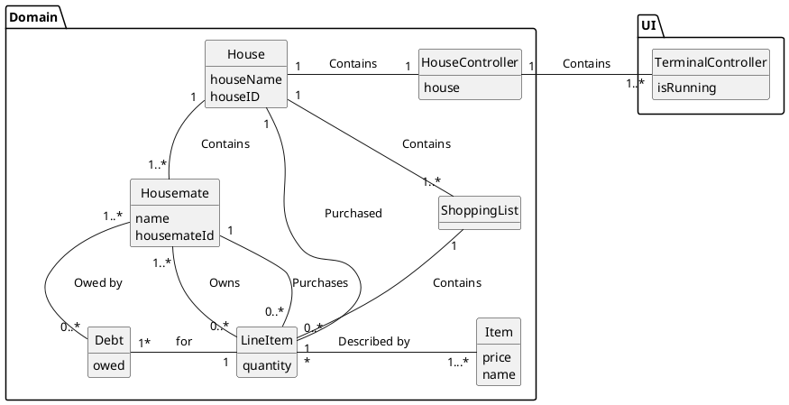
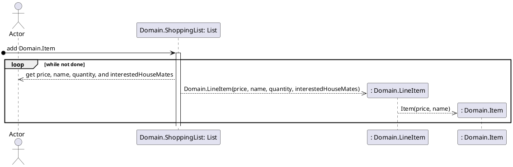
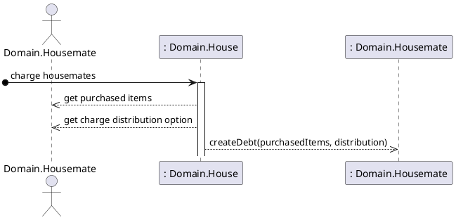
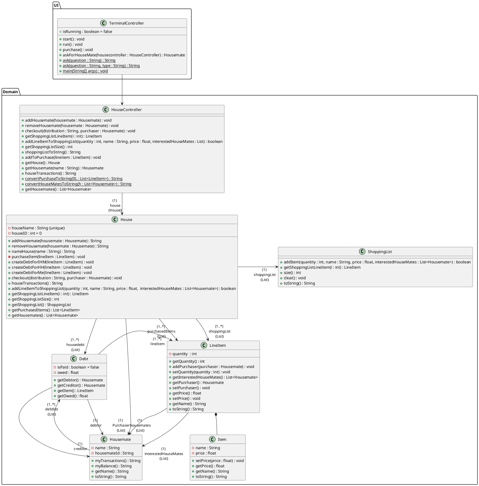

# Add Domain.Item Domain Model

```plantuml
@startuml
hide circle
hide empty methods

class UI.TerminalController{
    isRunning
}

class Domain.HouseController{
    house
}

class Domain.House{
    houseName
    houseID
}
class Domain.ShoppingList{ 
}
class Domain.LineItem{
    quantity
}

class Domain.Item{
    price
    name
}

class Domain.Debt{
    owed
}


class Domain.Housemate{   
    name
    housemateId
}

' associations
Domain.HouseController "1" - "1..*" UI.TerminalController : \tContains\t\t
Domain.House "1" - "1" Domain.HouseController : \tContains\t\t
Domain.House "1" -- "1..*" Domain.Housemate : \tContains\t\t
Domain.House "1" -- "1..*" Domain.ShoppingList : \tContains\t\t
Domain.House "1" -- "1" Domain.LineItem : \tPurchased\t\t
Domain.Housemate "1..*" - "0..*" Domain.LineItem : \tOwns\t\t
Domain.ShoppingList "1" -- "0..*" Domain.LineItem : \tContains\t\t
Domain.LineItem "*" - "1...*" Domain.Item : \tDescribed by \t\t
Domain.Housemate "1..*" -down- "0..*" Domain.Debt : \tOwed by\t\t
Domain.Debt "1*" -right- "1" Domain.LineItem : for
Domain.Housemate "1" - "0..*" Domain.LineItem : Purchases
@enduml


```
# Get Domain.Item Sequence Diagram

```plantuml

@startuml
actor Actor as Actor
participant "Domain.ShoppingList: List" as shoppingList
participant ": Domain.LineItem" as lineItem
participant ": Domain.Item" as item


[o-> shoppingList : add Domain.Item
activate shoppingList

loop while not done
    shoppingList -->> Actor  : get price, name, quantity, and interestedHouseMates
    shoppingList -->> lineItem **: Domain.LineItem(price, name, quantity, interestedHouseMates)
    lineItem -->> item **: Item(price, name)

end

activate shoppingList


@enduml
```

# Charge Domain.Housemate Sequence Diagram

```plantuml

@startuml
actor Domain.Housemate as Actor
participant ": Domain.House" as house
participant ": Domain.Housemate" as housemate


[o-> house : charge housemates
    activate house
    house -->> Actor  : get purchased items
    house -->> Actor  : get charge distribution option
    house -->> housemate : createDebt(purchasedItems, distribution)
@enduml
```

# Class Diagram

```plantuml
@startuml

class Domain.House {
    - houseName : String {unique}
    - houseID : int = 0
    + addHousemate(housemate : Housemate) : String
    + removeHousemate(housemate : Housemate) : String
    + nameHouse(name : String) : String
    - purchaseItem(lineItem : LineItem) : void
    + createDebtForIHM(lineItem : LineItem) : void
    + createDebtForHH(lineItem : LineItem) : void
    + createDebtForMe(lineItem : LineItem) : void
    + checkout(distribution : String, purchaser : Housemate) : void
    + houseTransactions() : String
    + addLineItemToShoppingList(quantity : int, name : String, price : float,  interestedHouseMates : List<Housemate>) : boolean
    + getShoppingListLineItem(i : int) : LineItem
    + getShoppingListSize() : int
    + getShoppingList() : ShoppingList
    + getPurchasedItems() : List<LineItem>
    + getHousemates() : List<Housemate>
    }
 Domain.House -> "(1) \nshoppingList\n{List}" Domain.ShoppingList : \t\t\t\t
 Domain.House --> "(1) \nhousemates\n{List}" Domain.Housemate : \t\t\t\t
 Domain.House --> "(1..*) \npurchasedItems\n{List}" Domain.LineItem : \t\t\t\t
 Domain.House -> "(1..*) \nhousedebt\n{List}" Domain.Debt : \t\t\t\t

class Domain.ShoppingList{
    + addItem(quantity : int, name : String, price : float, interestedHouseMates : List<Housemate>) : boolean
    + getShoppingListLineItem(i : int) : LineItem
    + size() : int
    + clear() : void
    + toString() : String
}
Domain.House --> "(1..*) \nshoppingList\n{List}" Domain.LineItem : \t\t\t\t

class Domain.LineItem {
    - quantity  : int 
    + getQuantity() : int
    + addPurchaser(purchaser : Housemate) : void
    + setQuantity(quantity : int) : void
    + getInterestedHouseMates() : List<Housemate>
    + getPurchaser() : Housemate
    + setPurchaser() : void
    + getPrice() : float
    + setPrice() : void
    + getName() : String
    + toString() : String
    }   
Domain.LineItem --> "(1) \ninterestedHouseMates\n{List}" Domain.Housemate : \t\t\t\t
Domain.LineItem --> "(1) \nPurchaser\n{List}" Domain.Housemate : \t\t\t\t
Domain.LineItem *-- Domain.Item

class Domain.Item {
    - name : String
    - price : float
    + setPrice(price : float) : void
    + getPrice() : float
    + getName() : String
    + toString() : String
    }

class Domain.Housemate {
    - name : String
    - housemateId : String
    + myTransactions() : String
    + myBalance() : String
    + getName() : String
    + toString() : String
    }
Domain.Housemate --> "(1..*) \ndebtlist\n{List}" Domain.Debt : \t\t\t\t

class Domain.Debt{
    - isPaid : boolean = false
    - owed : float
    + getDebtor() : Housemate
    + getCreditor() : Housemate
    + getItem() : LineItem
    + getOwed() : float
}
Domain.Debt -> "(1) \ndebtor\n" Domain.Housemate : \t\t\t\t
Domain.Debt -> "(1) \ncreditor\n" Domain.Housemate : \t\t\t\t
Domain.Debt -> "(1..*) \nlineItem\n" Domain.LineItem : \t\t\t\t

class Domain.HouseController{
    + addHousemate(housemate : Housemate) : void
    + removeHousemate(housemate : Housemate) : void
    + checkout(distribution : String, purchaser : Housemate) : void
    + getShoppingListLineItem(i : int) : LineItem
    + addLineItemToShoppingList(quantity : int, name : String, price : float, interestedHouseMates : List) : boolean
    + getShoppingListSize() : int
    + shoppingListToString() : String
    + addToPurchase(lineitem : LineItem) : void
    + getHouse() : House
    + getHousemate(name : String) : Housemate
    + houseTransactions() : String
    + {static} convertPurchaseToString(lIL : List<LineItem>) : String
    + {static} convertHouseMatesToString(h : List<Housemate>) : String
    + getHousemates() : List<Housemate>
}
Domain.HouseController --> "(1) \nhouse\n{House}" Domain.House :\t\t\t\t

class UI.TerminalController{
    + isRunning : boolean = false
    + start() : void
    + run() : void
    + purchase() : void
    + askForHouseMate(housecontroller : HouseController) : Housemate
    + {static} ask(question : String) : String
    + {static} ask(question : String, type : String) : String
    + {static} main(String[] args) : void
}
UI.TerminalController --> Domain.HouseController
@enduml
```
