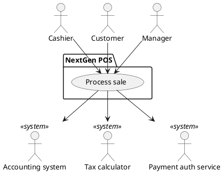

```plantuml
@startuml
' human actors
actor "Cashier" as cashier
actor "Customer" as customer
actor "Manager" as manager
' system actors
actor "Accounting system" <<system>> as accountingSystem
actor "Tax calculator" <<system>> as taxCalculator
actor "Payment auth service" <<system>> as payAuthService
' list all use cases in package
package "NextGen POS"{
usecase "Process sale" as procSale
}
' list relationships between actors and use cases
customer --> procSale
cashier --> procSale
manager --> procSale
procSale --> accountingSystem
procSale --> taxCalculator
procSale --> payAuthService
@enduml
```
