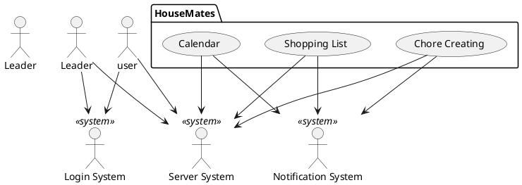

```plantuml
@startuml
' human actors
actor "Leader" as leader
actor "user" as user

' system actors
actor "Server System" <<system>> as serverSystem
actor "Notification System" <<system>> as notificationSystem
actor "Login System" <<system>> as loginSystem 

' list all use cases in package
package "HouseMates"{
usecase "Shopping List" as shoppingList
usecase "Calendar" as calendar
usecase "Chore Creating" as choreCreating
}
' list relationships between actors and use cases
Leader --> loginSystem
user --> loginSystem
Leader --> serverSystem
user --> serverSystem
shoppingList --> notificationSystem
calendar --> notificationSystem
choreCreating --> notificationSystem
shoppingList --> serverSystem
calendar --> serverSystem
choreCreating --> serverSystem

@enduml
```
